# 🔐 AWS OIDC Setup for NeuroBank FastAPI Toolkit

Este proyecto utiliza **AWS OIDC (OpenID Connect)** para autenticación segura con GitHub Actions, eliminando la necesidad de AWS Access Keys de larga duración.

## ✅ Configuración Completada

### 🔧 GitHub Secrets Requeridos

Solo necesitas **1 secret** en GitHub (opcional para API Key):

```
API_KEY = tu-api-key-para-la-app (opcional)
```

**El AWS Account ID ya está configurado en el workflow**: `120242956739`

### 🏗️ Infraestructura AWS Configurada

1. **OIDC Provider**: `token.actions.githubusercontent.com` ✅
   - ARN: `arn:aws:iam::120242956739:oidc-provider/token.actions.githubusercontent.com`
   - Audience: `sts.amazonaws.com`

2. **IAM Role**: `GitHubActionsOIDCRole`
   - ARN: `arn:aws:iam::120242956739:role/GitHubActionsOIDCRole`
   - Trust policy configurada para: `Neiland85/NeuroBank-FastAPI-Toolkit`
   - Permisos para ECR, Lambda, CloudFormation

3. **ECR Repository**: `neurobank-fastapi`
   - Se crea automáticamente si no existe en la región `eu-west-1`

## 🚀 Cómo Funciona

### Flujo de Control Manual
1. **Push automático** ejecuta solo **tests** y **security scans**
2. **Deployment requiere confirmación manual**:
   - Ve a GitHub Actions en tu repositorio
   - Selecciona "CI/CD Pipeline"
   - Haz clic en "Run workflow"
   - Selecciona "true" para desplegar a AWS
3. **No deployments automáticos** - total control del usuario

### Flujo de Autenticación OIDC
1. GitHub Actions genera un **JWT token temporal**
2. AWS verifica el token contra el **OIDC provider**
3. Si es válido, asume el **IAM role** temporalmente
4. Ejecuta deployment con **permisos limitados**
5. Token expira automáticamente

### Ventajas vs Access Keys
- ✅ **Sin claves de larga duración** almacenadas
- ✅ **Rotación automática** de credenciales
- ✅ **Permisos granulares** por repositorio
- ✅ **Auditoría mejorada** con session names
- ✅ **Mayor seguridad** general

## 📊 Pipeline de Deployment

```mermaid
graph TD
    A[Push to main] --> B[Run Tests]
    B --> C[Security Scan]
    C --> D[OIDC Authentication]
    D --> E[Build Docker Image]
    E --> F[Push to ECR]
    F --> G[SAM Build]
    G --> H[Deploy to Lambda]
    H --> I[Success! 🎉]
```



## 🔍 Troubleshooting

### Si falla la autenticación OIDC:
```bash
Error: Could not assume role with OIDC
```

**Solución:**
1. Verifica que el OIDC provider esté activo: `token.actions.githubusercontent.com`
2. Confirma que el IAM role existe: `GitHubActionsOIDCRole`
3. Revisa la trust policy del rol para el repositorio: `Neiland85/NeuroBank-FastAPI-Toolkit`
4. Account ID configurado: `120242956739`

### Si falla la creación del ECR:
```bash
Error: Repository does not exist
```

**Solución:**
- El workflow crea automáticamente el ECR repository
- Si falla, verifica permisos de ECR en el IAM role

## 🎯 Stack de Deployment

- **Stack Name**: `neurobank-api`
- **Region**: `eu-west-1`
- **Runtime**: `python3.11`
- **Architecture**: `x86_64`

## 📋 Comandos Útiles

```bash
# Ver el estado del stack
aws cloudformation describe-stacks --stack-name neurobank-api --region eu-west-1

# Ver logs de Lambda
aws logs tail /aws/lambda/NeuroBank-Function --region eu-west-1 --follow

# Listar versiones en ECR
aws ecr list-images --repository-name neurobank-fastapi --region eu-west-1

# Verificar el rol OIDC
aws iam get-role --role-name GitHubActionsOIDCRole

# Ver el OIDC provider
aws iam list-open-id-connect-providers
```

## 🔄 Workflow Jobs

1. **test**: Pytest con coverage
2. **security**: Bandit + Safety scanning
3. **deployment-check**: Verifica configuración OIDC
4. **build-and-deploy**: Deployment completo a AWS

---

🎉 **¡El deployment está completamente automatizado y seguro con OIDC!**
