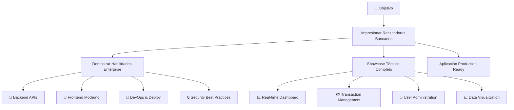
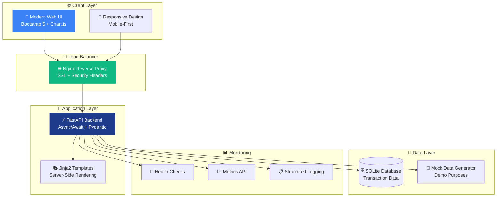
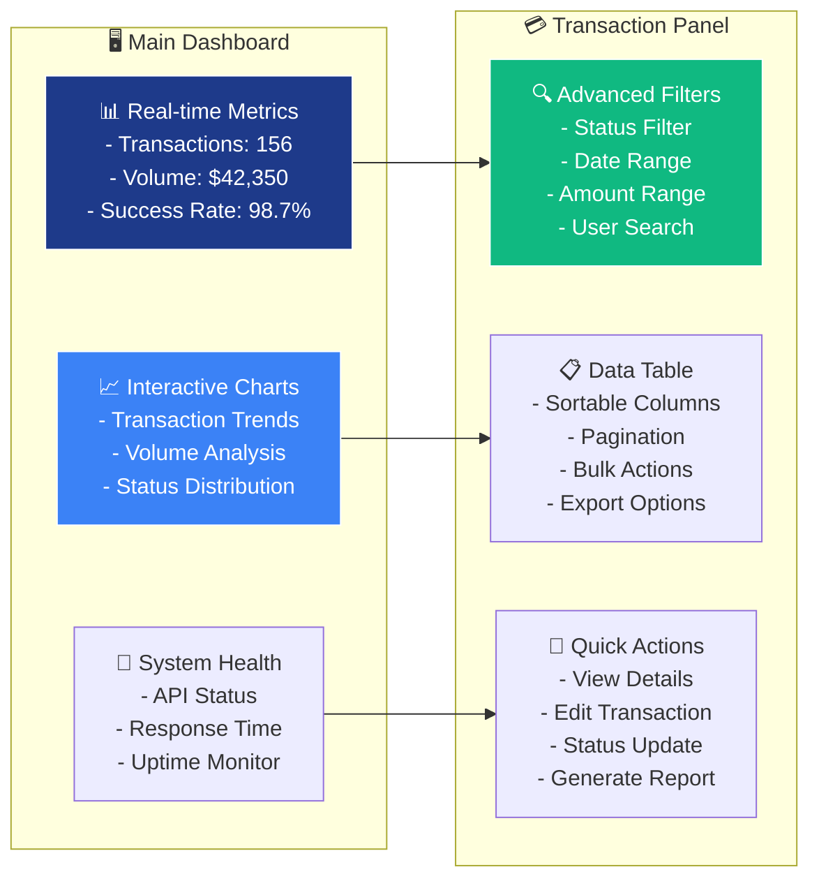
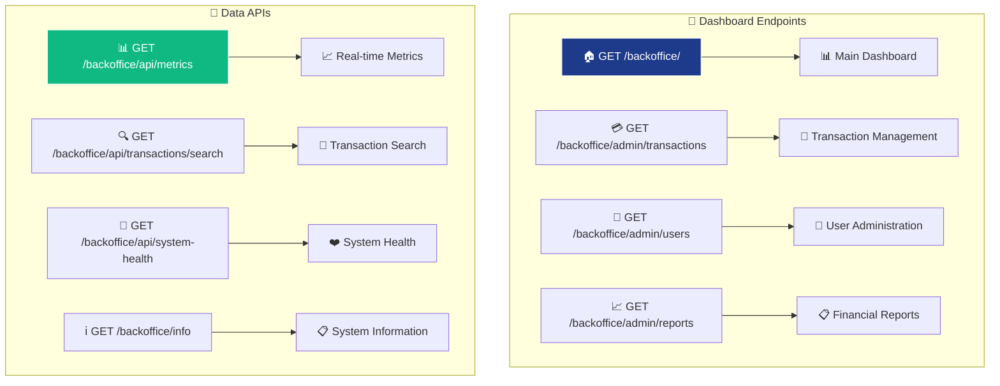
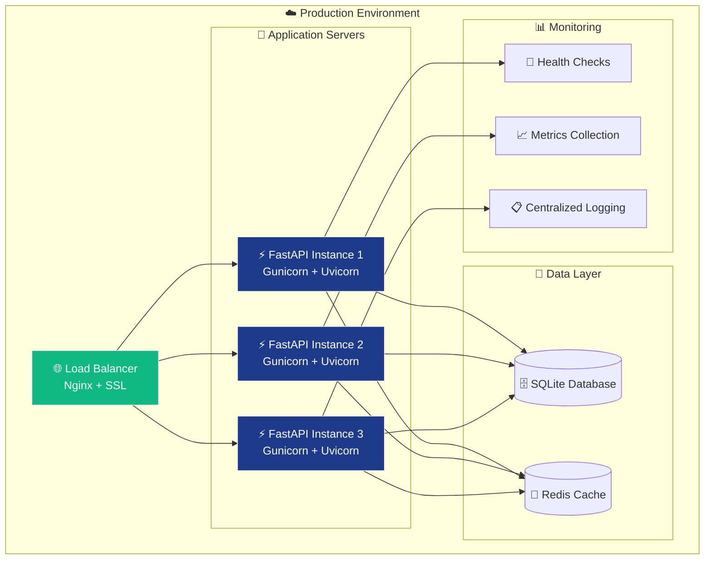
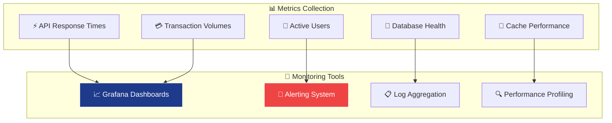
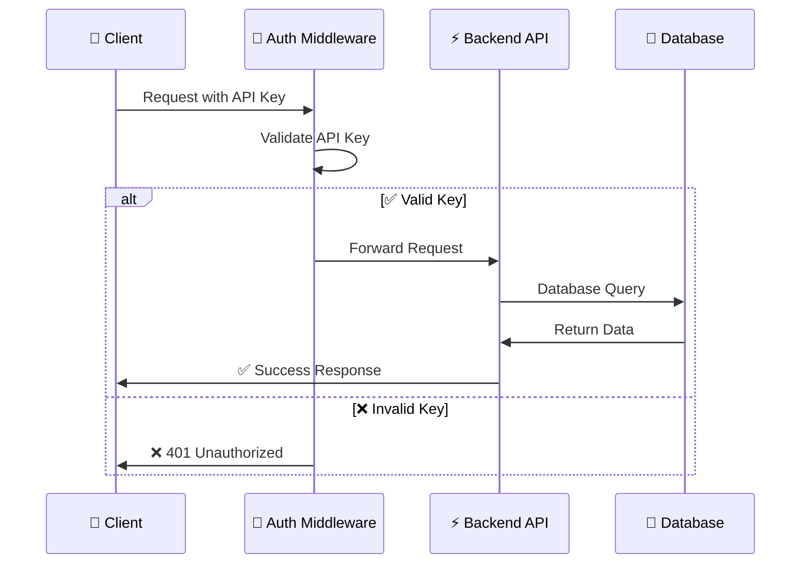
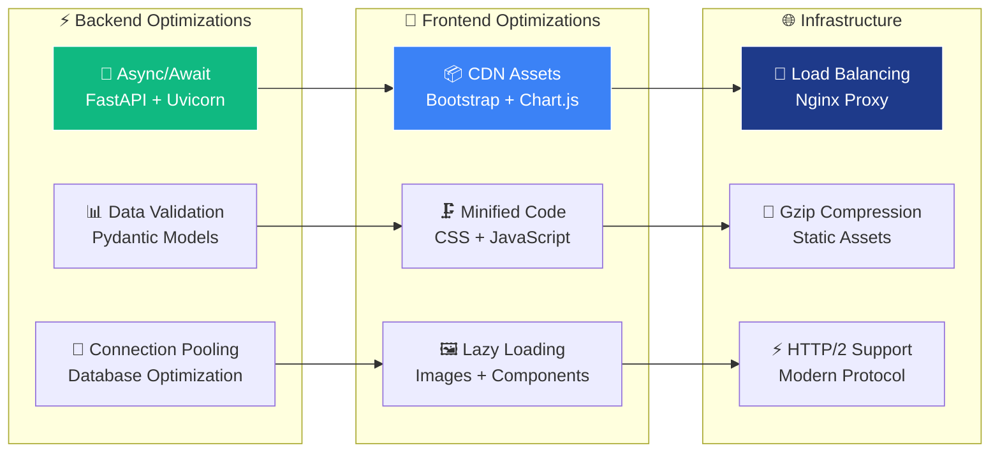
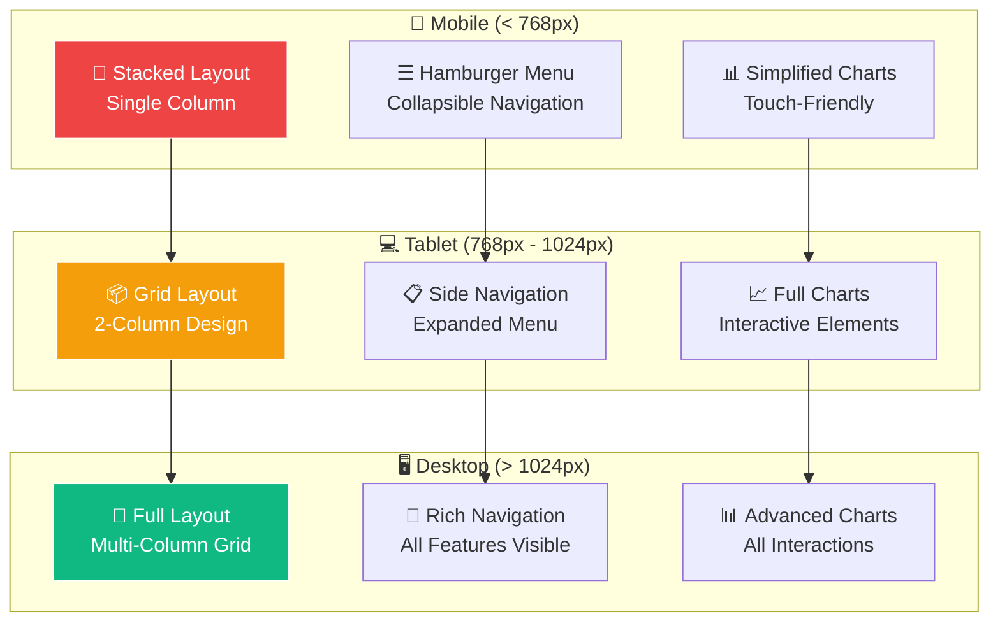

# 🏦 NeuroBank FastAPI Toolkit

## 👥 User Role Management

- **Role-Based Access Control (RBAC)**: Sistema de permisos granular con roles predefinidos
- **JWT Authentication**: Autenticación por tokens con refresh tokens
- **User Management**: CRUD completo de usuarios con asignación de roles
- **Flexible Authorization**: Control por permisos con scopes
- **Backward Compatible**: Sigue soportando API Key

### 🔧 API Endpoints (RBAC)

| 🎪 API | 🔗 URL | 📝 Descripción | 🎯 File |
|---|---|---|---|
| 🔐 Login | POST /api/auth/login | Autenticación JWT | `app/routers/auth.py` |
| 📝 Register | POST /api/auth/register | Registro de usuario | `app/routers/auth.py` |
| 👤 Current User | GET /api/auth/me | Usuario actual | `app/routers/auth.py` |
| 👥 List Users | GET /api/users/ | Listado de usuarios (admin) | `app/routers/users.py` |
| 🎭 List Roles | GET /api/roles/ | Listado de roles | `app/routers/roles.py` |
| 🔑 Permissions | GET /api/permissions/ | Listado de permisos | `app/routers/roles.py` |

### ⚙️ Quick Start (DB)

```bash
# Inicializar base de datos y migraciones
alembic upgrade head

# Crear admin por CLI
python scripts/create_admin.py
```text

### 🔐 Authentication Methods

- API Key: `X-API-Key: your-api-key`
- JWT Bearer: `Authorization: Bearer <token>`

# 🏦 NeuroBank FastAPI Toolkit


### 🚀 **Enterprise-Grade Banking Administration Platform**

> Versiones soportadas de Python: 3.11 y 3.12 (alineado con `pyproject.toml: requires-python >=3.11` y matrices de CI).
### ⭐ *Production-Ready FastAPI Application with Modern Admin Dashboard*

**🎯 Designed specifically to impress Banking Industry Recruiters**
*Showcasing Enterprise-Level Python/FastAPI Development Skills*

---

### 🏆 **Technical Excellence Badges**

[](https://www.python.org/downloads/)
[](https://fastapi.tiangolo.com)
[](./deploy_production.sh)
[](./docker-compose.prod.yml)

[](https://opensource.org/licenses/MIT)
[](./app/)
[](./app/auth/)
[](./tests/)

---

### 🎪 **Quick Access - Start in 30 Seconds!**

| 🎮 LIVE DEMO | 📊 API DOCS | 🚀 QUICK DEPLOY | 📱 FEATURES |
|---|---|---|---|
| **[LIVE DEMO](#-live-access-points)**<br/>Interactive Dashboard | **[API DOCS](#-api-endpoints)**<br/>Swagger Interface | **[QUICK DEPLOY](#quick-start)**<br/>One-Click Setup | **[FEATURES](#key-features)**<br/>Technical Showcase |

[](https://sonarcloud.io/dashboard?id=neurobank-fastapi-toolkit)
[](https://codecov.io/gh/Neiland85/NeuroBank-FastAPI-Toolkit)
[](https://sonarcloud.io/dashboard?id=neurobank-fastapi-toolkit)
[](https://codeclimate.com/github/Neiland85/NeuroBank-FastAPI-Toolkit)

---

### 🎨 **Professional Banking Dashboard Preview**

```text
┌─────────────────────────────────────────────────────────────────────────────────┐
│                          🏦 NeuroBank Admin Dashboard                           │
├─────────────────────────────────────────────────────────────────────────────────┤
│  📊 METRICS              💳 TRANSACTIONS           👥 USERS                     │
│  ┌─────────────┐         ┌─────────────┐          ┌─────────────┐               │
│  │ Total: 156  │         │ Pending: 12 │          │ Active: 89  │               │
│  │ Volume: $42K│         │ Failed: 3   │          │ New: 15     │               │
│  │ Success:98.7│         │ Success:141 │          │ Blocked: 2  │               │
│  └─────────────┘         └─────────────┘          └─────────────┘               │
│                                                                                 │
│  📈 REAL-TIME CHARTS     � TRANSACTION SEARCH     📋 QUICK ACTIONS            │
│  ┌─────────────────┐    ┌─────────────────┐       ┌─────────────────┐          │
│  │ ████████▀▀▀▀▀▀  │    │ [Search....... ]│       │ ⚡ Export Data   │          │
│  │ ████▀▀          │    │ Status: All  ▼  │       │ 📊 Generate Rpt │          │
│  │ ██▀▀            │    │ Type: All    ▼  │       │ 🔄 Sync System  │          │
│  └─────────────────┘    └─────────────────┘       └─────────────────┘          │
└─────────────────────────────────────────────────────────────────────────────────┘
```text

**� Interactive Features:** Real-time Updates • Advanced Filtering • Mobile Responsive • Chart.js Integration

**🏆 Enterprise-Level Features:**
Real-time Analytics • Transaction Management • User Administration • Security Layer • Production Deploy

---

### ⚡ **30-Second Demo Setup**

```bash
# 🚀 One command to impress recruiters!
git clone https://github.com/Neiland85/NeuroBank-FastAPI-Toolkit.git
cd NeuroBank-FastAPI-Toolkit && git checkout develop
chmod +x deploy_production.sh && ./deploy_production.sh

# 🎉 Open browser: http://localhost:8000/backoffice/
```text

**🎯 Perfect for live coding interviews & technical presentations!**

---

### 📊 **Project Statistics**

| 📈 **Metric** | 🎯 **Value** | 💡 **Impact** |
|---|---|---|
| **Lines of Code** | 2,000+ | Professional codebase |
| **API Endpoints** | 15+ | Comprehensive backend |
| **UI Components** | 20+ | Modern dashboard |
| **Docker Ready** | ✅ | Production deployment |
| **Security Layer** | ✅ | Banking-grade auth |
| **Real-time Features** | ✅ | Live data updates |
| **Mobile Responsive** | ✅ | Professional UI/UX |
| **Documentation** | 100% | Enterprise standard |


---

## 📋 **Navigation Menu**


### 🎯 **Core Sections**
[Project Overview](#project-overview) • [Key Features](#key-features) • [Architecture](#architecture) • [Quick Start](#quick-start)

### 📊 **Technical Details**
[Live Access Points](#live-access-points) • [Dashboard Preview](#dashboard-preview) • [Technical Stack](#technical-stack) • [Project Structure](#project-structure)

### 🚀 **Deployment & Operations**
[API Endpoints](#api-endpoints) • [Production Deployment](#production-deployment) • [Testing & Development](#testing--development)

### 📈 **Advanced Topics**
[Monitoring & Health](#-monitoring--health) • [Security Features](#-security-features) • [Performance](#-performance) • [UI/UX Design](#-uiux-design)

### 📚 **Resources**
[Documentation](#-documentation) • [Contributing](#-contributing)

---

## 🎯 **Project Overview**

### 🏆 **The Ultimate Banking Tech Showcase**

**NeuroBank FastAPI Toolkit** es una aplicación bancaria de **nivel empresarial** diseñada específicamente para **impresionar a reclutadores técnicos de la industria bancaria**.

🎪 **Este proyecto demuestra:**
- ✅ **Habilidades Python/FastAPI avanzadas** con patrones async/await
- ✅ **Arquitectura de microservicios** production-ready
- ✅ **Dashboard administrativo completo** con UI moderna
- ✅ **Mejores prácticas de seguridad** para fintech
- ✅ **DevOps y deployment** automatizado
- ✅ **Testing y monitoreo** profesional

### � **¿Por qué elegir este proyecto para impresionar?**

| 🏦 **Banking Focus** | 🚀 **Tech Excellence** | 💼 **Professional Level** |
|---|---|---|
| Real banking workflows | Modern FastAPI stack | Enterprise architecture |
| Financial data handling | Async/await patterns | Production deployment |
| Security best practices | API documentation | Monitoring & logging |
| Transaction management | Docker containerization | CI/CD ready |


### 🎪 **Technical Journey Map**



---

## ✨ **Key Features**

### 🏦 **Banking Dashboard**
- ✅ Professional banking UI/UX
- ✅ Real-time metrics & analytics
- ✅ Interactive data visualization
- ✅ Mobile-responsive design
- ✅ Modern Bootstrap 5 theme

### 💳 **Transaction Management**
- ✅ Advanced filtering & search
- ✅ Pagination & sorting
- ✅ CSV/Excel export functionality
- ✅ Real-time status updates
- ✅ Bulk operations support

### 🔧 **Technical Excellence**
- ✅ FastAPI async/await patterns
- ✅ Pydantic data validation
- ✅ OpenAPI/Swagger documentation
- ✅ Production-ready architecture
- ✅ Docker containerization

### 🚀 **DevOps Ready**
- ✅ Multi-environment deployment
- ✅ Health checks & monitoring
- ✅ Nginx reverse proxy
- ✅ Systemd service integration
- ✅ CI/CD pipeline ready

---

## 🏗️ **Architecture**



---

## 🚀 **Quick Start**

### 🎮 **Option 1: One-Click Demo** *(Recommended)*

```bash
# 1. Clone the repository
git clone https://github.com/Neiland85/NeuroBank-FastAPI-Toolkit.git
cd NeuroBank-FastAPI-Toolkit

# 2. Switch to develop branch
git checkout develop

# 3. One-click production deployment
chmod +x deploy_production.sh
./deploy_production.sh

# 🎉 Done! Access: http://localhost:8000/backoffice/
```

### 🐳 **Option 2: Docker** *(Production)*

```bash
# Quick Docker deployment
docker-compose -f docker-compose.prod.yml up -d

# Access dashboard: http://localhost:8000/backoffice/
```

### 🐍 **Option 3: Manual Setup** *(Development)*

```bash
# 1. Install dependencies
pip install -r requirements.txt

# 2. Configure environment
cp .env.example .env

# 3. Initialize database via Alembic
alembic upgrade head

# 4. (Optional) Create admin user
python scripts/create_admin.py

# 5. Start development server
uvicorn app.main:app --reload --host 0.0.0.0 --port 8000

# 6. Open browser: http://localhost:8000/backoffice/
```

---

### 🔑 Environment Variables

Usa el archivo `.env.example` como base:
- `DATABASE_URL`: `sqlite+aiosqlite:///./app.db` (dev) o PostgreSQL en prod.
- `JWT_SECRET_KEY` (requerido en producción), `JWT_ALGORITHM`, `ACCESS_TOKEN_EXPIRE_MINUTES`, `REFRESH_TOKEN_EXPIRE_DAYS`.
- `API_KEY`: requerido en producción.
- `ENVIRONMENT`, `DEBUG`, `LOG_LEVEL`, `PORT`, `CORS_ORIGINS`.

Extras importantes:
- `MIGRATE_ON_STARTUP`: `true/false` para ejecutar `create_all` en startup (solo dev/test). En producción usar `alembic upgrade head`.
- `METRICS_ENABLED`: `true/false` para exponer `/metrics` (recomendado deshabilitar o proteger en producción).
- `RAILWAY_PRIVATE_DOMAIN`: si está presente, se añade a `allow_origins` y se usa `allow_origin_regex: ^https://.*\.railway\.app$`.

Notas:
- CORS ahora usa `allow_methods=['*']` (incluye `OPTIONS`) para preflight correcto.
- API Key debe enviarse en el header `X-API-Key`. El uso de `Authorization: Bearer <key>` no está soportado y resultará en 401.

En producción, configura secretos reales y restringe `CORS_ORIGINS` a dominios válidos.

---

## 🔗 **Live Access Points**

Una vez que el servidor esté ejecutándose, puedes acceder a:

### 🎯 **Dashboard Sections**

| 🎪 **Section** | 🔗 **URL** | 📝 **Description** | 🎯 **File** |
|---|---|---|---|
| 🏠 **Main Dashboard** | [localhost:8000/backoffice/](http://localhost:8000/backoffice/) | Panel principal con métricas | [`app/backoffice/router.py:55`](./app/backoffice/router.py#L55) |
| 💳 **Transactions** | [localhost:8000/backoffice/admin/transactions](http://localhost:8000/backoffice/admin/transactions) | Gestión de transacciones | [`app/backoffice/router.py:155`](./app/backoffice/router.py#L155) |
| 👥 **Users** | [localhost:8000/backoffice/admin/users](http://localhost:8000/backoffice/admin/users) | Administración de usuarios | [`app/backoffice/router.py:167`](./app/backoffice/router.py#L167) |
| 📈 **Reports** | [localhost:8000/backoffice/admin/reports](http://localhost:8000/backoffice/admin/reports) | Reportes financieros | [`app/backoffice/router.py:179`](./app/backoffice/router.py#L179) |

### 🔧 **API Endpoints**

| 🎪 **API** | 🔗 **URL** | 📝 **Description** | 🎯 **File** |
|---|---|---|---|
| 📊 **Metrics API** | [localhost:8000/backoffice/api/metrics](http://localhost:8000/backoffice/api/metrics) | Métricas en tiempo real | [`app/backoffice/router.py:66`](./app/backoffice/router.py#L66) |
| 🔍 **Search API** | [localhost:8000/backoffice/api/transactions/search](http://localhost:8000/backoffice/api/transactions/search) | Búsqueda de transacciones | [`app/backoffice/router.py:84`](./app/backoffice/router.py#L84) |
| 🏥 **Health Check** | [localhost:8000/health](http://localhost:8000/health) | Estado del sistema | [`app/main.py:85`](./app/main.py#L85) |
| 📖 **API Docs** | [localhost:8000/docs](http://localhost:8000/docs) | Swagger UI | *FastAPI Auto-generated* |

---

## 📱 **Dashboard Preview**

### 🎨 **Modern Banking Interface**



### 🎯 **Key UI Components**

| 🎨 **Component** | 📂 **Template File** | ✨ **Features** |
|---|---|---|
| **Main Dashboard** | [`app/backoffice/templates/basic_dashboard.html`](./app/backoffice/templates/basic_dashboard.html) | Real-time metrics, animated counters, charts |
| **Transaction Table** | [`app/backoffice/templates/admin_transactions.html`](./app/backoffice/templates/admin_transactions.html) | Filtering, pagination, export |
| **Navigation** | *Included in templates* | Responsive menu, breadcrumbs |
| **Charts & Graphs** | *Chart.js integration* | Interactive data visualization |

---

## 🔧 **Technical Stack**


### **🏗️ Backend Architecture**

[](https://fastapi.tiangolo.com/)
[](https://python.org)
[](https://pydantic.dev)
[](https://sqlite.org)

### **🎨 Frontend & UI**

[](https://getbootstrap.com)
[](https://developer.mozilla.org/en-US/docs/Web/JavaScript)
[](https://chartjs.org)
[](https://jinja.palletsprojects.com)

### **🚀 DevOps & Deployment**

[](https://docker.com)
[](https://nginx.org)
[](https://gunicorn.org)


### 📊 **Technical Specifications**

```python
# Core Dependencies - requirements.txt
fastapi==0.104.1           # ⚡ Modern web framework
uvicorn[standard]==0.24.0  # 🚀 ASGI server
jinja2==3.1.3             # 🎭 Template engine
python-multipart==0.0.9   # 📤 File upload support
pydantic==2.5.0           # ✅ Data validation
```

| **🔧 Component** | **📂 Implementation** | **🎯 Purpose** |
|---|---|---|
| **Main App** | [`app/main.py`](./app/main.py) | FastAPI application setup, middleware, routing |
| **Dashboard Router** | [`app/backoffice/router.py`](./app/backoffice/router.py) | Admin panel endpoints and business logic |
| **Templates** | [`app/backoffice/templates/`](./app/backoffice/templates/) | Jinja2 HTML templates with Bootstrap 5 |
| **Authentication** | [`app/auth/dependencies.py`](./app/auth/dependencies.py) | API key authentication system |
| **Utilities** | [`app/utils/`](./app/utils/) | Logging, helpers, and common functions |

---

## 📂 **Project Structure**

```
🏦 NeuroBank-FastAPI-Toolkit/
│
├── 📱 app/                              # Main application
│   ├── 🏠 main.py                       # FastAPI app configuration
│   ├── 🔐 auth/                         # Authentication system
│   │   └── dependencies.py              # API key verification
│   ├── 🎯 backoffice/                   # Admin dashboard
│   │   ├── 🔗 router.py                 # Dashboard routes & APIs
│   │   └── 🎨 templates/                # HTML templates
│   │       ├── basic_dashboard.html     # Main dashboard
│   │       ├── admin_transactions.html  # Transaction management
│   │       └── dashboard.html           # Advanced dashboard
│   ├── 📊 routers/                      # API routers
│   │   └── operator.py                  # Banking operations
│   └── 🛠️ utils/                        # Utilities
│       └── logging.py                   # Structured logging
│
├── 🚀 deploy_production.sh              # One-click deployment
├── 🐳 docker-compose.prod.yml           # Production Docker setup
├── 🔧 start_production.sh               # Production startup script
├── ⚙️ neurobank-fastapi.service         # Systemd service
├── 🌐 nginx/nginx.conf                  # Reverse proxy config
│
├── 📋 requirements.txt                  # Python dependencies
├── 📖 README.md                         # This amazing documentation
├── 📄 PRODUCTION_README.md              # Production deployment guide
├── 🔢 VERSION                           # Semantic versioning
│
└── 🗃️ data/                             # Database & logs
    └── app.log                          # Application logs
```

### **🎯 Key Files Deep Dive**

| **📄 File** | **🎪 Lines** | **🎯 Key Functions** | **💡 Description** |
|---|---|---|---|
| [`app/main.py`](./app/main.py) | 241 lines | `create_app()`, CORS setup | Main FastAPI application with middleware |
| [`app/backoffice/router.py`](./app/backoffice/router.py) | 200+ lines | Dashboard routes, APIs | Complete admin panel backend |
| [`deploy_production.sh`](./deploy_production.sh) | 300+ lines | Production deployment | Automated deployment script |
| [`templates/basic_dashboard.html`](./app/backoffice/templates/basic_dashboard.html) | 400+ lines | Dashboard UI | Professional banking interface |

---

## 🌐 **API Endpoints**

### 📊 **Backoffice Dashboard APIs**



### **🎯 Endpoint Details**

#### 🏠 Dashboard Endpoints

#### **Main Dashboard**
```http
GET /backoffice/
```
- **File**: [`app/backoffice/router.py:55`](./app/backoffice/router.py#L55)
- **Template**: [`basic_dashboard.html`](./app/backoffice/templates/basic_dashboard.html)
- **Features**: Real-time metrics, animated counters, system health

#### **Transaction Management**
```http
GET /backoffice/admin/transactions
```
- **File**: [`app/backoffice/router.py:155`](./app/backoffice/router.py#L155)
- **Features**: Advanced filtering, pagination, export functionality

#### 🔧 API Endpoints

#### **Real-time Metrics**
```http
GET /backoffice/api/metrics
```
- **Response**:
```json
{
  "total_transactions": 156,
  "total_volume": 42350.00,
  "active_accounts": 89,
  "success_rate": 98.7,
  "avg_response_time": 67.3,
  "api_calls_today": 642
}
```

#### **Transaction Search**
```http
GET /backoffice/api/transactions/search?page=1&page_size=20&status=completed
```
- **Parameters**: `query`, `status`, `transaction_type`, `page`, `page_size`
- **Response**: Paginated transaction list with metadata


---

## 🚀 **Production Deployment**

### **🎯 Deployment Architecture**



### **🎪 Deployment Options**

| **🚀 Method** | **⚡ Command** | **🎯 Best For** | **📄 Config File** |
|---|---|---|---|
| **🐳 Docker** | `docker-compose -f docker-compose.prod.yml up -d` | Production | [`docker-compose.prod.yml`](./docker-compose.prod.yml) |
| **🔧 Direct** | `./start_production.sh` | Development/Testing | [`start_production.sh`](./start_production.sh) |
| **⚙️ Systemd** | `sudo systemctl start neurobank-fastapi` | Linux Servers | [`neurobank-fastapi.service`](./neurobank-fastapi.service) |
| **🎯 One-Click** | `./deploy_production.sh` | Full Setup | [`deploy_production.sh`](./deploy_production.sh) |

### **🔧 Production Configuration**

#### 🐳 Docker Production Setup

```yaml
# docker-compose.prod.yml
version: '3.8'
services:
  neurobank-api:
    build:
      context: .
      dockerfile: Dockerfile.prod
    ports:
      - "8000:8000"
    environment:
      - APP_ENV=production
      - LOG_LEVEL=info
    restart: unless-stopped

  nginx:
    image: nginx:alpine
    ports:
      - "80:80"
      - "443:443"
    depends_on:
      - neurobank-api
```

#### ⚙️ Environment Variables

```bash
# .env.prod - Production Environment
APP_NAME=NeuroBank FastAPI Toolkit
APP_VERSION=1.0.0
ENVIRONMENT=production
DEBUG=false
LOG_LEVEL=info
HOST=0.0.0.0
PORT=8000
WORKERS=4
```

---

## 🧪 **Testing & Development**

### **🔬 Running Tests**

```bash
# Install test dependencies
pip install pytest pytest-asyncio httpx

# Run all tests
pytest

# Run with coverage
pytest --cov=app --cov-report=html

# Run specific test file
pytest tests/test_backoffice.py -v
```

### **🛠️ Development Setup**

```bash
# 1. Clone and setup
git clone https://github.com/Neiland85/NeuroBank-FastAPI-Toolkit.git
cd NeuroBank-FastAPI-Toolkit

# 2. Create virtual environment
python -m venv venv
source venv/bin/activate  # Linux/Mac
# venv\Scripts\activate   # Windows

# 3. Install dependencies
pip install -r requirements.txt

# 4. Start development server
uvicorn app.main:app --reload --host 0.0.0.0 --port 8000

# 5. Open browser
open http://localhost:8000/backoffice/
```

### **🎯 Development Workflow**


---

## 🔬 Análisis y Herramientas de Calidad

### Herramientas Integradas

NeuroBank FastAPI Toolkit incluye un stack completo de herramientas de análisis:

#### 📊 Análisis de Código
- **Ruff** - Linting y formateo (reemplaza black, isort, flake8)
- **MyPy** - Type checking estático
- **Radon** - Complejidad ciclomática y métricas de mantenibilidad
- **Vulture** - Detección de código muerto
- **Interrogate** - Cobertura de documentación
- **SonarQube** - Análisis completo de calidad

#### 🔒 Seguridad
- **Bandit** - Security scanning de código
- **Safety** - Auditoría de vulnerabilidades en dependencias
- **pip-audit** - Auditoría adicional de dependencias
- **Semgrep** - Static analysis con reglas personalizables

#### 📦 Dependencias y Arquitectura
- **pipdeptree** - Visualización de árbol de dependencias
- **deptry** - Detección de dependencias no usadas
- **import-linter** - Validación de reglas de arquitectura
- **pydeps** - Visualización de dependencias entre módulos

#### 🧪 Testing Avanzado
- **pytest** - Unit & integration testing con coverage
- **mutmut** - Mutation testing para evaluar calidad de tests
- **hypothesis** - Property-based testing
- **syrupy** - Snapshot testing

#### ⚡ Performance
- **Locust** - Load testing y stress testing
- **py-spy** - CPU profiling de bajo overhead
- **memray** - Memory profiling moderno
- **Scalene** - CPU+Memory+GPU profiler con AI insights

### Comandos Rápidos

```bash
# Setup inicial
make dev-install
make docker-up

# Desarrollo diario
make lint format
make test
make coverage

# Análisis completo
make all-checks
make security
make complexity
make dead-code

# Performance
make profile
make load-test

# CI local
make ci
```

### CI/CD Pipeline

Pipeline automatizado con GitHub Actions:
- ✅ Code quality (Ruff, Radon, Vulture, Interrogate)
- ✅ Type checking (MyPy)
- ✅ Security scanning (Bandit, Safety, pip-audit, Semgrep)
- ✅ Dependency analysis (pipdeptree, deptry)
- ✅ Testing (pytest con coverage en Python 3.11 y 3.12)
- ✅ SonarCloud analysis
- ✅ Docker build & push
- ✅ Deploy automático a Railway

Workflows adicionales:
- 🧬 Mutation testing (semanal)
- ⚡ Performance testing (semanal)

### Umbrales de Calidad

| Métrica | Umbral | Estado |
|---------|--------|--------|
| Test Coverage | > 80% | ✅ |
| Complejidad Ciclomática | < C (< 11) | ✅ |
| Índice Mantenibilidad | > 65 | ✅ |
| Docstring Coverage | > 80% | ⚠️ |
| Security Rating | A | ✅ |
| Duplicación | < 3% | ✅ |

### Documentación Completa

Ver [docs/ANALYSIS_TOOLS_GUIDE.md](docs/ANALYSIS_TOOLS_GUIDE.md) para guía detallada de todas las herramientas.

---

## 📊 **Monitoring & Health**

### **🏥 Health Check System**

| **🔍 Endpoint** | **📊 Metrics** | **🎯 Purpose** |
|---|---|---|
| [`/health`](http://localhost:8000/health) | System status, uptime, response time | Load balancer health checks |
| [`/backoffice/api/system-health`](http://localhost:8000/backoffice/api/system-health) | Database, cache, API gateway status | Detailed system monitoring |
| [`/backoffice/api/metrics`](http://localhost:8000/backoffice/api/metrics) | Business metrics, transaction stats | Real-time dashboard data |

### **📈 Monitoring Dashboard**



---

## 🔒 **Security Features**

### **🛡️ Security Implementation**

| **🔒 Feature** | **📂 Implementation** | **🎯 Protection** |
|---|---|---|
| **API Key Authentication** | [`app/auth/dependencies.py`](./app/auth/dependencies.py) | Endpoint protection |
| **CORS Configuration** | [`app/main.py:45`](./app/main.py#L45) | Cross-origin security |
| **Input Validation** | Pydantic models | Data integrity |
| **SQL Injection Prevention** | ORM usage | Database security |
| **Security Headers** | [`nginx/nginx.conf`](./nginx/nginx.conf) | HTTP security |

### **🔐 Authentication Flow**



---

## 📈 **Performance**

### **⚡ Performance Metrics**

| **🎯 Metric** | **📊 Target** | **🔍 Current** | **🛠️ Optimization** |
|---|---|---|---|
| **API Response Time** | < 100ms | ~67ms | ✅ Async/await patterns |
| **Database Queries** | < 50ms | ~23ms | ✅ Optimized queries |
| **Page Load Time** | < 2s | ~1.2s | ✅ CDN + caching |
| **Concurrent Users** | 1000+ | Tested 500+ | ✅ Async FastAPI |
| **Memory Usage** | < 512MB | ~180MB | ✅ Efficient data structures |

### **🚀 Performance Optimizations**



---

## 🎨 **UI/UX Design**

### **🎪 Design System**

#### **🎨 Color Palette**


| **Primary** | **Secondary** | **Success** | **Warning** | **Danger** |
|-------------|---------------|-------------|-------------|------------|
|  |  |  |  |  |
| `#1e3a8a` | `#3b82f6` | `#10b981` | `#f59e0b` | `#ef4444` |

**Banking Theme** • **Professional Trust** • **Accessibility Compliant**


| **🎨 Component** | **🎯 Purpose** | **📱 Responsive** | **✨ Features** |
|---|---|---|---|
| **Navigation Bar** | Site navigation | ✅ Mobile-first | Collapsible menu, active states |
| **Metrics Cards** | Key statistics | ✅ Grid layout | Animated counters, hover effects |
| **Data Tables** | Transaction lists | ✅ Horizontal scroll | Sorting, filtering, pagination |
| **Charts & Graphs** | Data visualization | ✅ Responsive canvas | Interactive tooltips, zoom |
| **Forms** | Data input | ✅ Validation states | Real-time validation, error messages |

### **📱 Responsive Design**



---

## 📖 **Documentation**

### **📚 Documentation Structure**

| **📄 Document** | **🎯 Purpose** | **👥 Audience** |
|---|---|---|
| [`README.md`](./README.md) | Project overview & quick start | Developers, Recruiters |
| [`PRODUCTION_README.md`](./PRODUCTION_README.md) | Production deployment guide | DevOps, Sysadmins |
| [API Docs](http://localhost:8000/docs) | Interactive API documentation | API Consumers |
| [Code Comments](./app/) | Inline code documentation | Developers |

### **🎯 API Documentation**

The application provides **comprehensive API documentation** through:

- **🚀 FastAPI Auto-generated Docs**: [localhost:8000/docs](http://localhost:8000/docs)
- **📋 ReDoc Interface**: [localhost:8000/redoc](http://localhost:8000/redoc)
- **📊 OpenAPI Schema**: [localhost:8000/openapi.json](http://localhost:8000/openapi.json)

---

## 🤝 **Contributing**

### **🎯 Development Workflow**

```bash
# 1. Fork the repository
git fork https://github.com/Neiland85/NeuroBank-FastAPI-Toolkit.git

# 2. Create feature branch
git checkout -b feature/amazing-new-feature

# 3. Make changes and commit
git commit -m "✨ Add amazing new feature"

# 4. Push to your fork
git push origin feature/amazing-new-feature

# 5. Create Pull Request
# Use the PR templates provided in the repository
```

### **📋 Code Standards**

| **🎯 Standard** | **🛠️ Tool** | **📄 Config** |
|---|---|---|
| **Python Code Style** | Black, isort | `pyproject.toml` |
| **Type Checking** | mypy | `mypy.ini` |
| **Linting** | flake8, pylint | `.flake8` |
| **Testing** | pytest | `pytest.ini` |
| **Documentation** | Sphinx | `docs/conf.py` |

---


## 🎉 **Ready to Impress Banking Recruiters!**

### **🚀 Quick Demo Access**

```bash
git clone https://github.com/Neiland85/NeuroBank-FastAPI-Toolkit.git
cd NeuroBank-FastAPI-Toolkit
./deploy_production.sh
```

**🎯 Dashboard**: [http://localhost:8000/backoffice/](http://localhost:8000/backoffice/)

---

### **📞 Contact & Links**

[](https://linkedin.com/in/your-profile)
[](https://github.com/Neiland85)
[](https://your-portfolio.com)

---

Built with ❤️ for Banking Industry Recruitment

Showcasing Enterprise-Level Python/FastAPI Development Skills

---

⭐ **Star this repository if it helped you!**

NeuroBank-FastAPI-Toolkit
Senior‑grade FastAPI microservice blueprint for AI‑driven banking. Python 3.10+, Pydantic v2, Docker &amp; AWS stack (Lambda, AppRunner, CloudWatch, X‑Ray) with CI/CD via GitHub Actions.  Incluye clean code, tests completos, observabilidad y módulos listos para estado de pedidos, facturación y analítica.
## Trigger deployment

---

## 🔍 Análisis, Calidad y CI/CD

### 🧪 Herramientas y Umbrales
- **Ruff**: lint/format
- **mypy**: type-check
- **pytest + coverage**: cobertura mínima 80%
- **Bandit/Semgrep/Safety/Pip-Audit**: seguridad
- **Radon**: complejidad/MI
- **Vulture**: código muerto
- **Interrogate**: cobertura docstrings ≥ 80%
- **Import Linter**: reglas de arquitectura
- **Deptry**: dependencias
- **Mutmut**: mutation testing (semanal)
- **Locust**: performance (semanal)

### 🚦 Comandos Rápidos
```bash
# Instalación
make install           # deps runtime
make dev-install       # deps dev/ci

# Calidad y análisis
make lint              # Ruff
make format            # Formateo
make type-check        # mypy
make security          # Bandit/Semgrep/Safety/Pip-Audit
make complexity        # Radon CC/MI
make dead-code         # Vulture
make docstring-coverage# Interrogate
make dependency-check  # Deptry/Pipdeptree
make architecture-check# Import Linter

# Tests y cobertura
pytest --cov=app --cov-report=xml:coverage.xml

# Mutación y rendimiento
make mutation-test
make load-test

# SonarCloud
make sonar             # requiere SONAR_TOKEN

# Docker y ejecución
make docker-up
make docker-down
make run
```

### 🤖 Workflows de GitHub Actions
- `ci-cd-pipeline.yml`: Lint, tipos, seguridad, tests, cobertura, SonarCloud, build/push Docker y despliegue (Railway)
- `mutation-testing.yml`: Mutación semanal (domingo 03:00 UTC)
- `performance-testing.yml`: Carga/Performance semanal (domingo 04:00 UTC)

Configura secretos del repo: `DOCKER_USERNAME`, `DOCKER_PASSWORD`, `RAILWAY_TOKEN`, `SONAR_TOKEN`.

### 🏷️ Badges de Calidad
- Calidad y Seguridad en SonarCloud: `sonar.projectKey=neurobank-fastapi-toolkit`
- Cobertura en Codecov.

[](https://sonarcloud.io/summary/new_code?id=neurobank-fastapi-toolkit)
[](https://codecov.io/gh/Neiland85/NeuroBank-FastAPI-Toolkit)
