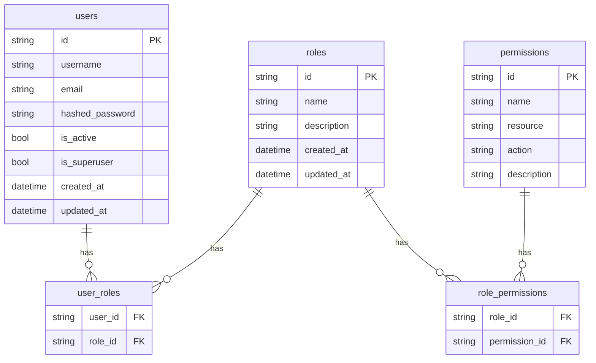

# RBAC y Autenticación en NeuroBank FastAPI

## 1) Overview
NeuroBank implementa un modelo de seguridad híbrido:
- JWT con scopes para RBAC (roles y permisos granulares)
- API Key legacy para algunos endpoints de operator

Relaciones principales:
- `User` M:N `Role`
- `Role` M:N `Permission`
- Permisos con formato `resource:action` (por ejemplo: `users:read`)

Roles predefinidos (seed): `admin`, `auditor`, `customer`.

---

## 2) Métodos de Autenticación
- JWT Bearer: cabecera `Authorization: Bearer <access_token>`
- API Key (legacy): cabecera `X-API-Key: <key>` para rutas de `operator`

Rutas protegidas por JWT y RBAC:
- `/api/auth/*`, `/api/users/*`, `/api/roles/*`

---

## 3) Roles y Permisos
- Permiso = `resource:action`, p. ej., `users:read`, `users:write`, `users:delete`, `roles:read`, `roles:write`
- Los endpoints verifican permisos usando `Security(require_permissions(), scopes=[...])`

Scopes por recurso Users:
- GET `/api/users/` → `users:read`
- GET `/api/users/{id}` → `users:read`
- POST `/api/users/` → `users:write`
- PUT `/api/users/{id}` → `users:write`
- DELETE `/api/users/{id}` → `users:delete`

Scopes por recurso Roles:
- GET `/api/roles/` → `roles:read`
- POST `/api/roles/` → `roles:write`
- PUT `/api/roles/{id}` → `roles:write`
- DELETE `/api/roles/{id}` → `roles:delete`
- POST `/api/roles/{id}/permissions` → `roles:write`

---

## 4) Gestión de Usuarios
- Registro: `POST /api/auth/register` (por defecto rol `customer`)
- Login: `POST /api/auth/login` → `access_token` + `refresh_token`
- Perfil: `GET /api/auth/me`
- Refresh: `POST /api/auth/refresh`
- Admin CRUD: `/api/users/*` con permisos (`users:*`)
- Asignación de roles: `POST /api/users/{user_id}/roles` con body `['auditor', 'customer']`

---

## 5) Ejemplos de uso (curl)

Autenticación:
```bash
# Registro
curl -X POST http://localhost:8000/api/auth/register \
  -H 'Content-Type: application/json' \
  -d '{"username":"john","email":"john@example.com","password":"SecurePass123"}'

# Login (OAuth2 form)
curl -X POST http://localhost:8000/api/auth/login \
  -H 'Content-Type: application/x-www-form-urlencoded' \
  -d 'username=john&password=SecurePass123'

# Perfil (/me)
curl -H 'Authorization: Bearer <ACCESS>' http://localhost:8000/api/auth/me

# Refresh
auth_refresh=$(curl -s -X POST 'http://localhost:8000/api/auth/refresh?refresh_token=<REFRESH>')
```

Usuarios (admin):
```bash
# Listar
curl -H 'Authorization: Bearer <ADMIN>' http://localhost:8000/api/users/

# Crear
curl -X POST http://localhost:8000/api/users/ \
  -H 'Authorization: Bearer <ADMIN>' -H 'Content-Type: application/json' \
  -d '{"username":"alice","email":"alice@example.com","password":"SecurePass123"}'

# Actualizar
curl -X PUT http://localhost:8000/api/users/<USER_ID> \
  -H 'Authorization: Bearer <ADMIN>' -H 'Content-Type: application/json' \
  -d '{"full_name":"Alice Updated"}'

# Asignar roles
curl -X POST http://localhost:8000/api/users/<USER_ID>/roles \
  -H 'Authorization: Bearer <ADMIN>' -H 'Content-Type: application/json' \
  -d '["auditor"]'

# Eliminar
curl -X DELETE -H 'Authorization: Bearer <ADMIN>' \
  http://localhost:8000/api/users/<USER_ID>
```

Roles (admin):
```bash
# Listar roles
curl -H 'Authorization: Bearer <ADMIN>' http://localhost:8000/api/roles/

# Crear rol
curl -X POST http://localhost:8000/api/roles/ \
  -H 'Authorization: Bearer <ADMIN>' -H 'Content-Type: application/json' \
  -d '{"name":"reviewer","description":"Can review"}'

# Asignar permisos por nombre
curl -X POST http://localhost:8000/api/roles/<ROLE_ID>/permissions \
  -H 'Authorization: Bearer <ADMIN>' -H 'Content-Type: application/json' \
  -d '["users:read"]'
```

---

## 6) Mejores prácticas de seguridad
- Rotar `JWT_SECRET_KEY` y usar valores fuertes en producción
- Tokens de acceso de vida corta; refresh tokens con rotación
- Principio de mínimo privilegio en roles/permisos
- Restringir `CORS_ORIGINS` a dominios de confianza
- Auditar accesos a endpoints críticos y cambios de rol

### Timestamps en UTC
- Las respuestas incluyen `created_at`/`updated_at` en ISO-8601 con zona horaria (UTC).
- Ejemplos válidos: `2025-07-20T15:30:45.123456Z` o `+00:00`.
- Los modelos ORM usan `DateTime(timezone=True)` y el backend fija tiempos con `datetime.now(UTC)`.

---

## 7) Esquema de Base de Datos


---

## 8) Migraciones (Alembic)
1. Asegura modelos unificados en `app/models.py` y `alembic/env.py` con `target_metadata = Base.metadata`.
2. Generar inicial (si fuera necesario):
```bash
alembic revision --autogenerate -m "init rbac"
```
3. Aplicar migraciones:
```bash
alembic upgrade head
```
La migración inicial debe crear: `users`, `roles`, `permissions`, `user_roles`, `role_permissions`.

---

## 9) Troubleshooting
- 401: token inválido/expirado → relogin o refresh
- 403: permisos insuficientes → revisar scopes del token y roles asignados
- Alembic no encuentra revisiones → verifica `alembic/versions/` y la tabla `alembic_version`
- Modelos duplicados → consolida `app/models.py` y elimina definiciones repetidas

---

## 10) API Reference (resumen)
- Auth: `/api/auth/login`, `/api/auth/register`, `/api/auth/me`, `/api/auth/refresh`
- Users: `/api/users/` (GET/POST), `/api/users/{id}` (GET/PUT/DELETE), `/api/users/{id}/roles` (POST)
- Roles: `/api/roles/` (GET/POST), `/api/roles/{id}` (GET/PUT/DELETE), `/api/roles/{id}/permissions` (POST)
